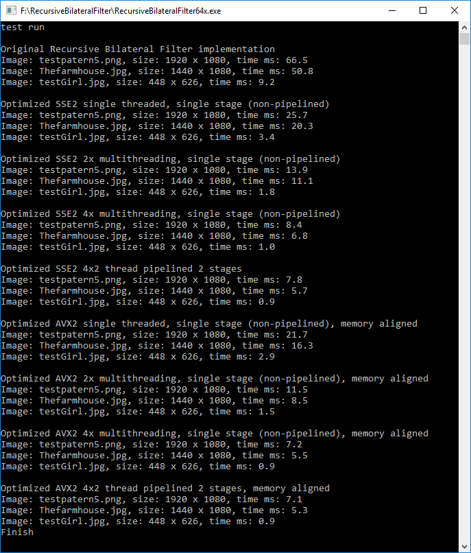
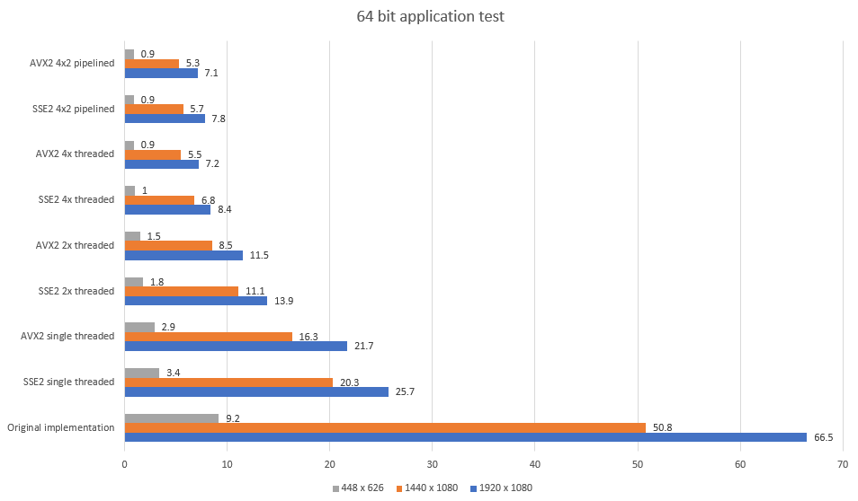
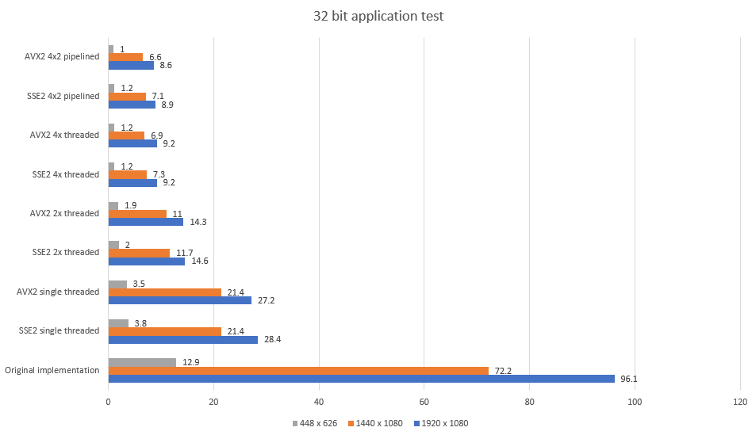
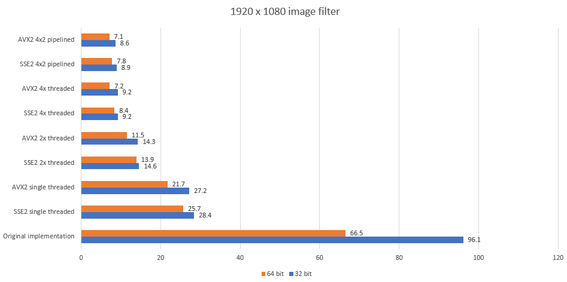

# Optimized Recursive Bilateral Filter

This project is a derivative work based on this project:
https://github.com/ufoym/RecursiveBF

The main purpose of this project is to provide a more optimized implementation of the Recursive Bilateral Filter. For more information about the image filter, see the link above

Optimization is based on 3 categories: reducing memory usage, adding multithreading, adding SSE2 / AVX2 C++ intrinsics

* Memory usage: in original implementation, memory usage of RGB32 or RGBA image would be roughtly = width * height * 40 + width * 40. In optimized implemention, it is roughly = width * height * 4 + width * 80 for non-piplined version. And width * height * 12 + width * 80 for pipelined. In general, almost 10x less memory allocation

* Multithreading: original implementation is written as single threaded solution, and in a way that it not easy split into threads. Optimized solution is multithread friendly because it separates the filter into 2 stages, one for horizontal filter pass, other for vertical filter pass. Each filter pass can then be subdivided into user chosen number of threads. For horizontal filter, each thread handles its own row from original data buffer, while for vertical pass, each thread handles its own column block

* SSE2 and AVX2: original implementation is written in basic C++ and while it is possible to select SSE2 or AVX2 optimization guidelines in compiler, the generated code does not properly take advantage of that functionality. Optimized solution provides 2 separate implementations, one written almost exclusively with SSE2 intrinsics, another almost exclusively with AVX2 intrinsics, so the compiler can utilize their capabilities much more effectively.

It's important to mention that this optimized implementation has some fundamental differences with the original. Those are:

* Only images with 4 bytes per pixel are accepted, this means RGB32 or RGBA. With some light modifications, it would be possible to adapt it to work with RGB24, single channel, or YUV 422 (2 pixels in 4 bytes)

* Edge detection algorithm is different. In original version, 3 components (RBG) of 2 adjacent pixels are evaluated for absolute difference, then 2 of those absolute differences are divided by 4 and added together, 3rd component is divided by 2 and added to the sum. The goal is to get absolute difference between 2 pixels in 0-255 range, but this solution makes one of the components have 2x significance of other 2. Optimized solution offers 2 alternative options (chosen which compiler flag): either get maximum of absolute differences between 3 components (stronger blur) or get 255 saturated sum of absolute differences of 3 components (weaker blur). Both methods have equal cost. The value of 4th component (alpha) is not taken into account, but it would be easy to do so if needed

* Sigma Spatial: in original implementation, sigma spatial, one of the 2 blur parameters, has depedency on image width and height. That means the same value would yield different amount of blur based on size of the image. Optimized solution removes that dependency by anchoring sigma spatiel to arbitrary value of 255, making it uniform for both width and height.

For testing purposes, 3 images were chosen: 

* testGirl.jpg - smallest image, 448 x 626, it is the same image used in original implementation 
* Thefarmhouse.jpg - larger image, 1440 x 1080, it is a painting with lots of small noise that can be blurred. 
* testpatern5.png - full HD image, 1920 x 1080, it is a test pattern that has no noise and sharp edges. It is useful for purpose of verifying that edge preserving image filter has minimum impact on the edges

Here's what built 64 bit application output looks like on Intel i7-4700HQ (~2.4 GHz):

Image paths and blur strength (sigma) values are hardcoded, at top of RecursiveBilateralFilter.cpp
When application runs, it saves filtered image under generated name in same folder as original images

Here is the same data in chart form, so it's easier to understand (time is in ms):

It's interesting to note that the same application compiled as 32 bit performs significantly slower, especially for the original function

Here's direct comparison of 64 bit vs 32 bit for full HD image

Optimized solution provides 2 filter functions, one is designed for synchronous use - when multithreading is enabled, the function splits its work among threads and waits until they finish. Other filter function is asynchronous "push pipeline" mode, it divides task in 2 stages, horizontal filter pass and vertical filter pass. When horizontal pass is finished, it can start on next image while vertical pass starts on results of horizontal pass. 
Further optimizations with multithreading are possible, current implementation is provided as simple example.

Most of the focus of this project is on utilization of XMM and YMM registers with SSE2 and AVX2 intrinsic functions. From the charts above, it is clear that even single threaded solution offers considerable speed up over original. It's also interesting to note that additional multithreading has diminishing returns, especially for small images.

SSE2 based filter solution was implemented to work with unaligned image buffers, while AVX2 requires input and output buffers to follow 32 byte alignment. It is possible to remove or relax that requirement with minor modications, there is not a significant penalty of working with unaligned memory for read operations, but write operations would need a few extra instructions and generally make for messier code

This project also provides a simple unoptimized C++ implementation of the Recursive Bilateral Filter in files RBFilterPlain.h, RBFilterPlain.cpp. This implementation does not participate in tests and it is only useful for the purposes of helping to understand the core of the algorithm. It's also useful for tinkering with filter design

In conclusion, the most optimized implementation of Recursive Bilateral Filter is able to achieve roughtly 10x speed up over original (slightly less)

It is even possible to process full HD video at 60 fps, with some room to spare on CPU (tho not much). For video processing, it would be best to add YUV 420 support, which is somewhat more involved due to its planar format.

